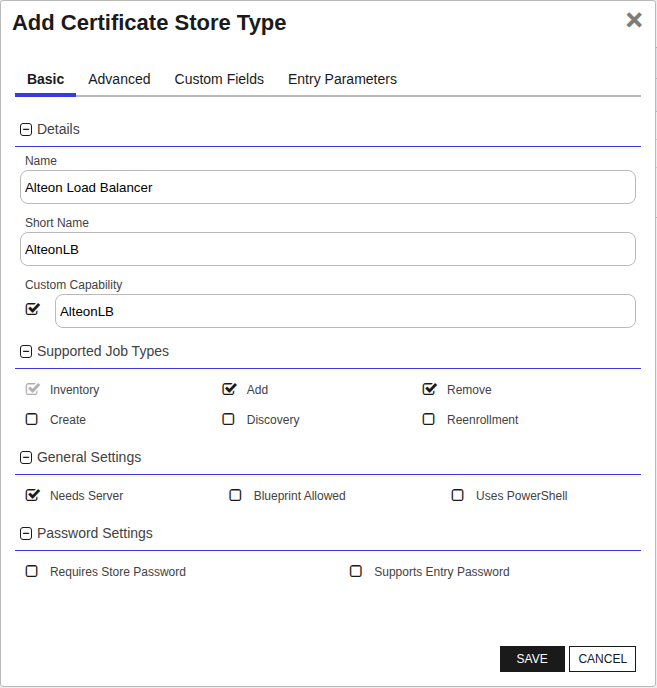
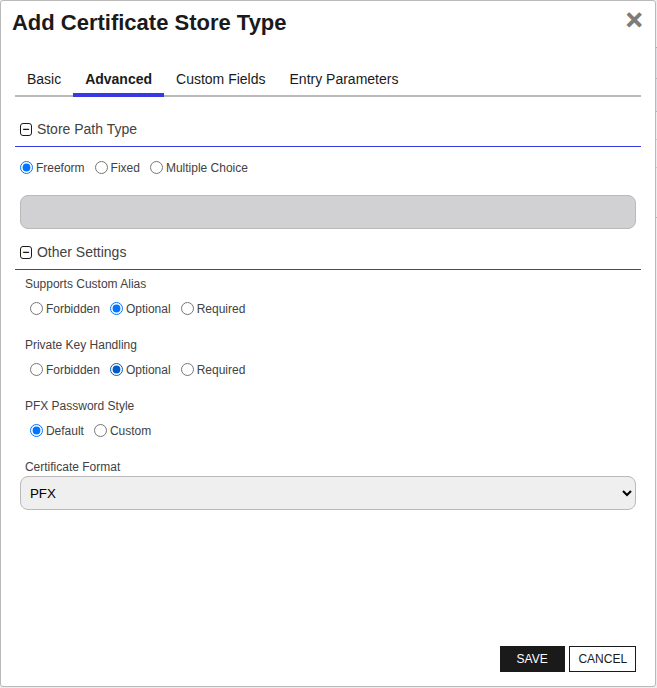
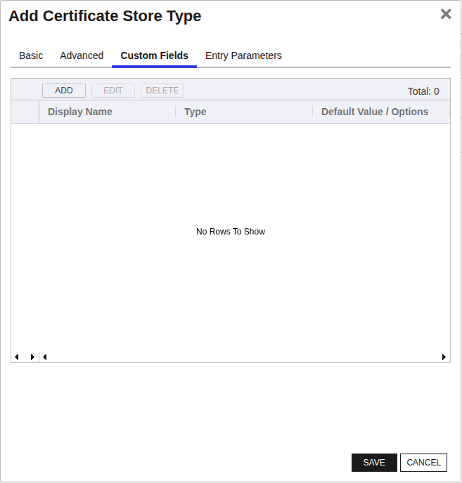

<h1 align="center" style="border-bottom: none">
    Alteon Load Balancer Universal Orchestrator Extension
</h1>

<p align="center">
  <!-- Badges -->

<a href="https://github.com/Keyfactor/alteon-orchestrator/releases"></a>


</p>

<p align="center">
  <!-- TOC -->
  <a href="#support">
    <b>Support</b>
  </a>
  ·
  <a href="#installation">
    <b>Installation</b>
  </a>
  ·
  <a href="#license">
    <b>License</b>
  </a>
  ·
  <a href="https://github.com/orgs/Keyfactor/repositories?q=orchestrator">
    <b>Related Integrations</b>
  </a>
</p>

## Overview

The Alteon Load Balancer integration allows you to manage certificates on a Radware Alteon Load Balancer appliance via its REST API. It supports inventory, enrollment (Add), and removal of certificates, and includes the ability to bind certificates to one or more virtual services as part of the enrollment workflow.

The integration handles both non-SNI (direct) and SNI certificate bindings automatically, detecting the appropriate path based on the current virtual service configuration on the device. SSL policies for non-SNI bindings are created and managed by the integration using a consistent naming convention. Apply and Save operations are performed automatically after each change to ensure configuration changes are activated and persisted on the device.


## Compatibility

This integration is compatible with Keyfactor Universal Orchestrator version 10.1 and later.

## Support
The Alteon Load Balancer Universal Orchestrator extension is supported by Keyfactor. If you require support for any issues or have feature request, please open a support ticket by either contacting your Keyfactor representative or via the Keyfactor Support Portal at https://support.keyfactor.com.

> If you want to contribute bug fixes or additional enhancements, use the **[Pull requests](../../pulls)** tab.

## Requirements & Prerequisites

Before installing the Alteon Load Balancer Universal Orchestrator extension, we recommend that you install [kfutil](https://github.com/Keyfactor/kfutil). Kfutil is a command-line tool that simplifies the process of creating store types, installing extensions, and instantiating certificate stores in Keyfactor Command.


## AlteonLB Certificate Store Type

To use the Alteon Load Balancer Universal Orchestrator extension, you **must** create the AlteonLB Certificate Store Type. This only needs to happen _once_ per Keyfactor Command instance.


TODO Overview is a required section


#### Supported Operations

| Operation    | Is Supported                                                                                                           |
|--------------|------------------------------------------------------------------------------------------------------------------------|
| Add          | ✅ Checked        |
| Remove       | ✅ Checked     |
| Discovery    | 🔲 Unchecked  |
| Reenrollment | 🔲 Unchecked |
| Create       | 🔲 Unchecked     |

#### Store Type Creation

##### Using kfutil:
`kfutil` is a custom CLI for the Keyfactor Command API and can be used to create certificate store types.
For more information on [kfutil](https://github.com/Keyfactor/kfutil) check out the [docs](https://github.com/Keyfactor/kfutil?tab=readme-ov-file#quickstart)
   <details><summary>Click to expand AlteonLB kfutil details</summary>

   ##### Using online definition from GitHub:
   This will reach out to GitHub and pull the latest store-type definition
   ```shell
   # Alteon Load Balancer
   kfutil store-types create AlteonLB
   ```

   ##### Offline creation using integration-manifest file:
   If required, it is possible to create store types from the [integration-manifest.json](./integration-manifest.json) included in this repo.
   You would first download the [integration-manifest.json](./integration-manifest.json) and then run the following command
   in your offline environment.
   ```shell
   kfutil store-types create --from-file integration-manifest.json
   ```
   </details>


#### Manual Creation
Below are instructions on how to create the AlteonLB store type manually in
the Keyfactor Command Portal
   <details><summary>Click to expand manual AlteonLB details</summary>

   Create a store type called `AlteonLB` with the attributes in the tables below:

   ##### Basic Tab
   | Attribute | Value | Description |
   | --------- | ----- | ----- |
   | Name | Alteon Load Balancer | Display name for the store type (may be customized) |
   | Short Name | AlteonLB | Short display name for the store type |
   | Capability |  | Store type name orchestrator will register with. Check the box to allow entry of value |
   | Supports Add | ✅ Checked | Check the box. Indicates that the Store Type supports Management Add |
   | Supports Remove | ✅ Checked | Check the box. Indicates that the Store Type supports Management Remove |
   | Supports Discovery | 🔲 Unchecked |  Indicates that the Store Type supports Discovery |
   | Supports Reenrollment | 🔲 Unchecked |  Indicates that the Store Type supports Reenrollment |
   | Supports Create | 🔲 Unchecked |  Indicates that the Store Type supports store creation |
   | Needs Server | ✅ Checked | Determines if a target server name is required when creating store |
   | Blueprint Allowed | 🔲 Unchecked | Determines if store type may be included in an Orchestrator blueprint |
   | Uses PowerShell | 🔲 Unchecked | Determines if underlying implementation is PowerShell |
   | Requires Store Password | 🔲 Unchecked | Enables users to optionally specify a store password when defining a Certificate Store. |
   | Supports Entry Password | 🔲 Unchecked | Determines if an individual entry within a store can have a password. |

   The Basic tab should look like this:

   

   ##### Advanced Tab
   | Attribute | Value | Description |
   | --------- | ----- | ----- |
   | Supports Custom Alias | Optional | Determines if an individual entry within a store can have a custom Alias. |
   | Private Key Handling | Optional | This determines if Keyfactor can send the private key associated with a certificate to the store. Required because IIS certificates without private keys would be invalid. |
   | PFX Password Style | Default | 'Default' - PFX password is randomly generated, 'Custom' - PFX password may be specified when the enrollment job is created (Requires the Allow Custom Password application setting to be enabled.) |

   The Advanced tab should look like this:

   

   > For Keyfactor **Command versions 24.4 and later**, a Certificate Format dropdown is available with PFX and PEM options. Ensure that **PFX** is selected, as this determines the format of new and renewed certificates sent to the Orchestrator during a Management job. Currently, all Keyfactor-supported Orchestrator extensions support only PFX.

   ##### Custom Fields Tab
   Custom fields operate at the certificate store level and are used to control how the orchestrator connects to the remote target server containing the certificate store to be managed. The following custom fields should be added to the store type:

   | Name | Display Name | Description | Type | Default Value/Options | Required |
   | ---- | ------------ | ---- | --------------------- | -------- | ----------- |

   The Custom Fields tab should look like this:

   


   ##### Entry Parameters Tab

   | Name | Display Name | Description | Type | Default Value | Entry has a private key | Adding an entry | Removing an entry | Reenrolling an entry |
   | ---- | ------------ | ---- | ------------- | ----------------------- | ---------------- | ----------------- | ------------------- | ----------- |
   | VirtualServiceBindings | Virtual Service Bindings | Comma-separated list of virtual service bindings in 'virtId:servicePort' format. Each binding identifies the virtual server ID and the service port to which the certificate should be bound. Example: '1:443' for a single binding, or '1:443,2:443,my-virt:8443' for multiple bindings. Returned during inventory to show which virtual services each certificate is currently bound to. | String |  | 🔲 Unchecked | 🔲 Unchecked | 🔲 Unchecked | 🔲 Unchecked |

   The Entry Parameters tab should look like this:

   


   ##### Virtual Service Bindings
   Comma-separated list of virtual service bindings in 'virtId:servicePort' format. Each binding identifies the virtual server ID and the service port to which the certificate should be bound. Example: '1:443' for a single binding, or '1:443,2:443,my-virt:8443' for multiple bindings. Returned during inventory to show which virtual services each certificate is currently bound to.

   
   


   </details>

## Installation

1. **Download the latest Alteon Load Balancer Universal Orchestrator extension from GitHub.**

    Navigate to the [Alteon Load Balancer Universal Orchestrator extension GitHub version page](https://github.com/Keyfactor/alteon-orchestrator/releases/latest). Refer to the compatibility matrix below to determine the asset should be downloaded. Then, click the corresponding asset to download the zip archive.

   | Universal Orchestrator Version | Latest .NET version installed on the Universal Orchestrator server | `rollForward` condition in `Orchestrator.runtimeconfig.json` | `alteon-orchestrator` .NET version to download |
   | --------- | ----------- | ----------- | ----------- |
   | Older than `11.0.0` | | | `net6.0` |
   | Between `11.0.0` and `11.5.1` (inclusive) | `net6.0` | | `net6.0` |
   | Between `11.0.0` and `11.5.1` (inclusive) | `net8.0` | `Disable` | `net6.0` || Between `11.0.0` and `11.5.1` (inclusive) | `net8.0` | `LatestMajor` | `net8.0` |
   | `11.6` _and_ newer | `net8.0` | | `net8.0` | 

    Unzip the archive containing extension assemblies to a known location.

    > **Note** If you don't see an asset with a corresponding .NET version, you should always assume that it was compiled for `net6.0`.

2. **Locate the Universal Orchestrator extensions directory.**

    * **Default on Windows** - `C:\Program Files\Keyfactor\Keyfactor Orchestrator\extensions`
    * **Default on Linux** - `/opt/keyfactor/orchestrator/extensions`

3. **Create a new directory for the Alteon Load Balancer Universal Orchestrator extension inside the extensions directory.**

    Create a new directory called `alteon-orchestrator`.
    > The directory name does not need to match any names used elsewhere; it just has to be unique within the extensions directory.

4. **Copy the contents of the downloaded and unzipped assemblies from __step 2__ to the `alteon-orchestrator` directory.**

5. **Restart the Universal Orchestrator service.**

    Refer to [Starting/Restarting the Universal Orchestrator service](https://software.keyfactor.com/Core-OnPrem/Current/Content/InstallingAgents/NetCoreOrchestrator/StarttheService.htm).


6. **(optional) PAM Integration**

    The Alteon Load Balancer Universal Orchestrator extension is compatible with all supported Keyfactor PAM extensions to resolve PAM-eligible secrets. PAM extensions running on Universal Orchestrators enable secure retrieval of secrets from a connected PAM provider.

    To configure a PAM provider, [reference the Keyfactor Integration Catalog](https://keyfactor.github.io/integrations-catalog/content/pam) to select an extension and follow the associated instructions to install it on the Universal Orchestrator (remote).


> The above installation steps can be supplemented by the [official Command documentation](https://software.keyfactor.com/Core-OnPrem/Current/Content/InstallingAgents/NetCoreOrchestrator/CustomExtensions.htm?Highlight=extensions).


## Defining Certificate Stores


### Store Creation

#### Manually with the Command UI

<details><summary>Click to expand details</summary>

1. **Navigate to the _Certificate Stores_ page in Keyfactor Command.**

    Log into Keyfactor Command, toggle the _Locations_ dropdown, and click _Certificate Stores_.

2. **Add a Certificate Store.**

    Click the Add button to add a new Certificate Store. Use the table below to populate the **Attributes** in the **Add** form.

   | Attribute | Description                                             |
   | --------- |---------------------------------------------------------|
   | Category | Select "Alteon Load Balancer" or the customized certificate store name from the previous step. |
   | Container | Optional container to associate certificate store with. |
   | Client Machine | The hostname or IP address of the Alteon Load Balancer device (example: https://alteonlb.test.com). |
   | Store Path |  |
   | Orchestrator | Select an approved orchestrator capable of managing `AlteonLB` certificates. Specifically, one with the `` capability. |

</details>


#### Using kfutil CLI

<details><summary>Click to expand details</summary>

1. **Generate a CSV template for the AlteonLB certificate store**

    ```shell
    kfutil stores import generate-template --store-type-name AlteonLB --outpath AlteonLB.csv
    ```
2. **Populate the generated CSV file**

    Open the CSV file, and reference the table below to populate parameters for each **Attribute**.

   | Attribute | Description |
   | --------- | ----------- |
   | Category | Select "Alteon Load Balancer" or the customized certificate store name from the previous step. |
   | Container | Optional container to associate certificate store with. |
   | Client Machine | The hostname or IP address of the Alteon Load Balancer device (example: https://alteonlb.test.com). |
   | Store Path |  |
   | Orchestrator | Select an approved orchestrator capable of managing `AlteonLB` certificates. Specifically, one with the `` capability. |

3. **Import the CSV file to create the certificate stores**

    ```shell
    kfutil stores import csv --store-type-name AlteonLB --file AlteonLB.csv
    ```

</details>


#### PAM Provider Eligible Fields
<details><summary>Attributes eligible for retrieval by a PAM Provider on the Universal Orchestrator</summary>

If a PAM provider was installed _on the Universal Orchestrator_ in the [Installation](#Installation) section, the following parameters can be configured for retrieval _on the Universal Orchestrator_.

   | Attribute | Description |
   | --------- | ----------- |
   | ServerUsername | Username to use when connecting to server |
   | ServerPassword | Password to use when connecting to server |

Please refer to the **Universal Orchestrator (remote)** usage section ([PAM providers on the Keyfactor Integration Catalog](https://keyfactor.github.io/integrations-catalog/content/pam)) for your selected PAM provider for instructions on how to load attributes orchestrator-side.
> Any secret can be rendered by a PAM provider _installed on the Keyfactor Command server_. The above parameters are specific to attributes that can be fetched by an installed PAM provider running on the Universal Orchestrator server itself.

</details>


> The content in this section can be supplemented by the [official Command documentation](https://software.keyfactor.com/Core-OnPrem/Current/Content/ReferenceGuide/Certificate%20Stores.htm?Highlight=certificate%20store).


### Setup and Configuration

The high level steps required to configure the Alteon Load Balancer Orchestrator extension are:

1) [Create the Store Type in Keyfactor](#create-the-store-type-in-keyfactor)

1) [Install the Extension on the Orchestrator](#install-the-extension-on-the-orchestrator)

1) [Create the Certificate Store](#create-the-certificate-store)

---

#### Create the Store Type in Keyfactor

Now we can navigate to the Keyfactor platform and create the store type for the extension.

1) Navigate to your instance of Keyfactor and log in with a user that has Administrator priveledges.

1) Click on the gear icon in the top left and navigate to "Certificate Store Types".

     

1) Click "Add" to open the Add Certificate Store dialog.

1) Name the new store type "Alteon Load Balancer" and give it the short name of "AlteonLB".

1) The Alteon Load Balancer integration supports the following job types: _Inventory, Add, Remove_.  Select from these the capabilities you would like to utilize.

1) Make sure that "Needs Server" is checked.

     


1) Set the following values on the __Advanced__ tab:
     1) **Supports Custom Alias** - Optional
     1) **Private Key Handling** - Optional

     

1) On the __Entry Parameters__ tab, add the following parameter:

   | Name | Display Name | Type | Required for Add | Required for Remove | Description |
   | ---- | ------------ | ---- | :--------------: | :-----------------: | ----------- |
   | `VirtualServiceBindings` | Virtual Service Bindings | String | ❌ | ❌ | Comma-separated list of virtual service bindings in `virtId:servicePort` format. Specifies which virtual services the certificate should be bound to. See [Virtual Service Bindings](#virtual-service-bindings) for details. |

#### Install the Extension on the Orchestrator

_The process for installing an extension for the universal orchestrator differs from the process of installing an extension for the Windows orchestrator.  Follow the below steps to register the integration with your instance of the universal orchestrator._

1) Stop the Universal Orchestrator service.

     1) Note: In Windows, the default name of this service is "Keyfactor Orchestrator Service (Default)"

1) Create a folder in the "extensions" folder of the Universal Orchestrator installation folder named "AlteonLB"

     1) example: `C:\Program Files\Keyfactor\Keyfactor Orchestrator\\_AlteonLB_`

1) Copy the build output (if you compiled from source) or the contents of the zip file (if you downloaded the pre-compiled binaries) into this folder.

1) Start the Universal Orchestrator Service

#### Create the certificate store

Now add the certificate store that corresponds to an instance of the Alteon Load Balancer.

The steps to do this are:

1) Navigate to "Locations > Certificate Stores"

1) Click "ADD"

     

1) Enter the values corresponding to the Alteon Load Balancer instance.

- **Category**: Alteon Load Balancer
- **Container**: _optional logical container in keyfactor for the certificates from this store_
- **Client Machine**: The Alteon Load Balancer Server and port

  - Note: The server credentials will only have to be entered once, even if adding multiple certificate stores.  
    - Set the credentials to those of the account with sufficient permissions to manage certs in the Alteon Load Balancer.
    - Check __Use SSL__
    - The __Server Name__ should be the fully qualified URL and port of the Alteon Load Balancer instance.


- **Store Path**: This value isn't used for this integration (other than to uniquely identify the cert store in certificate searches).  

---

### Virtual Service Bindings

This integration supports binding certificates to one or more Alteon virtual services as part of the certificate enrollment (Add) workflow. The **Virtual Service Bindings** entry parameter controls which virtual services a certificate is bound to, and the inventory job returns this information so that Keyfactor Command maintains an accurate view of where each certificate is deployed.

#### Entry Parameter Format

The `VirtualServiceBindings` entry parameter accepts a comma-separated list of bindings, where each binding is expressed as:

```
virtId:servicePort
```

| Component | Description | Example |
| --------- | ----------- | ------- |
| `virtId` | The virtual server ID as configured on the Alteon device | `1`, `my-virt` |
| `servicePort` | The TCP port of the HTTPS service on that virtual server | `443`, `8443` |

**Examples:**

```


## License

Apache License 2.0, see [LICENSE](LICENSE).

## Related Integrations

See all [Keyfactor Universal Orchestrator extensions](https://github.com/orgs/Keyfactor/repositories?q=orchestrator).